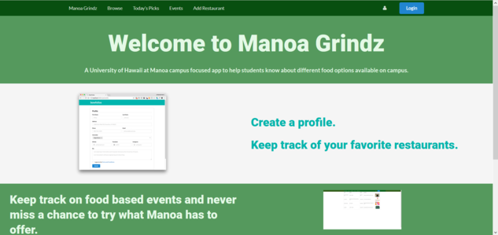
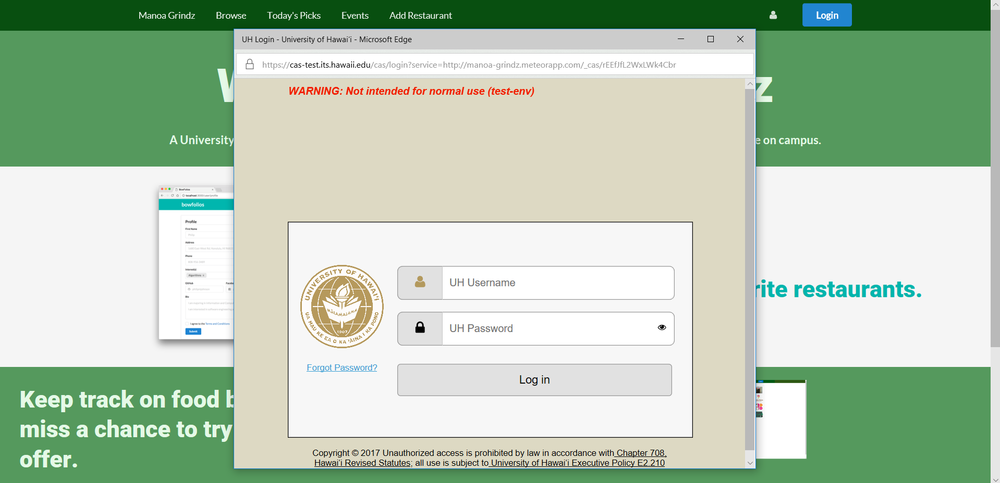

  
  
  

Manoa-Grindz is a food app that University of Hawaii students can use to look for food around the Manoa campus. It features a login system where UH Manoa students can log in with their UH credentials and view the various food options on campus. The app features a browse page and also a today's picks page where students can view the top food choices for the day. 

For this project, I worked in a group with two other classmates who were in my ICS 314 Software Engineering class. Together we designed the app and added functionality to it over a total of 1 month. Although the app is not 100% finished, we tried to add enough funcitonality to it so that people could get a good understanding as to what the application was about. I learned many skills from this project, including how to manage a software project with a group and how to develop a meteor application overtime through various milestone accompolishments. 

You can learn more at the [Manoa Grindz Project Page](https://manoa-grindz.github.io/).

