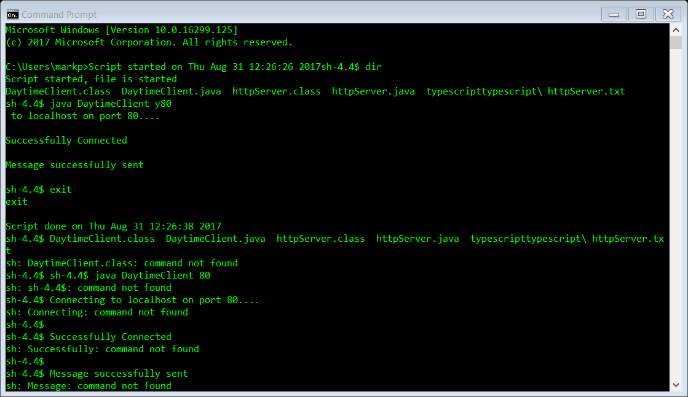

This is a simple HTTP Server application that I wrote in my ICS 451 Data Networks class. This program uses the Java socket classes. The HTTP server will just print the date and time when it receives a request and close the connection after that. 

In this project I gained experience wtih how a HTTP server serves requests. Even though the program is very simple, it was fun to create and run using the command line. This project gave me an idea of how the Java Socket class is managed and how data can be sent and read using a buffered reader. 
Source: <a href="https://github.com/markpm808/HTTP-Server-Applicaiton-in-Java"><i class="large github icon"></i>theVacay/vacay</a>
